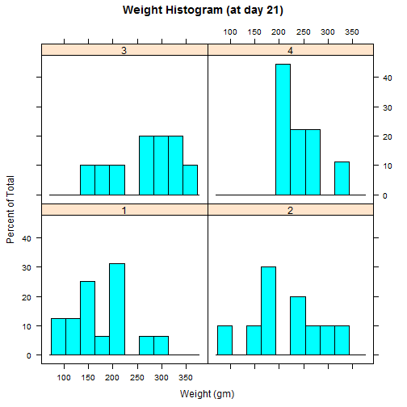
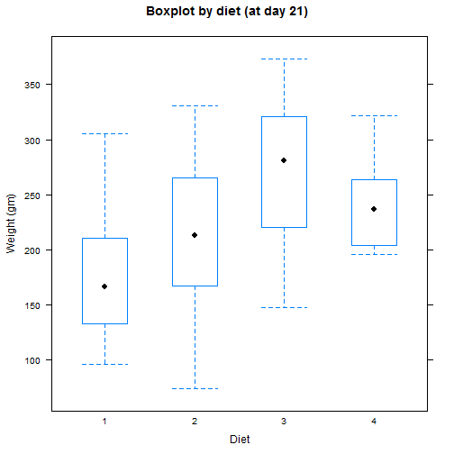

Pitch for the Chicks Diet Explorer
========================================================
author: Luis Seabra Coelho
date: October 22, 2015

The data
========================================================
left: 43%

The purpose of this project is to find the ideal diet for chicks (meaning, the diet that will make them the heaviest).
And we started off with with this dataset on R with the weight of chicks according to their diet in order to check if this was an idea worth chasing. This dataset includes a total of 50 chicks on 4 different diets. The dataset is structured as follows:
***

```
  weight Time Chick Diet
1     42    0     1    1
2     51    2     1    1
3     59    4     1    1
4     64    6     1    1
5     76    8     1    1
6     93   10     1    1
```

Histogram
========================================================

The collected data goes from day 0 up to day 21, so we should start exploring the chick's weight at the latest time, day 21.

The histogram of the chick's weight at that time is as follows, separated by diet:
***
 

Boxplot
========================================================

A simple boxplot showing the weight (when the chicks are 21 days old) grouped by the diet show how much the weight varies according to the diet, allows to consider if the diet has an influence on the weight.
***
 

Conclusion
========================================================

So there's ground to suspect that diet 3 allows the chicks to grow more than the others and that should be investigsted. So the next steps would be:

- Approve the next phase in this project: and determine exactly how much and how significant is the diet,
- And develop an industrial process to produce the components of the diet
